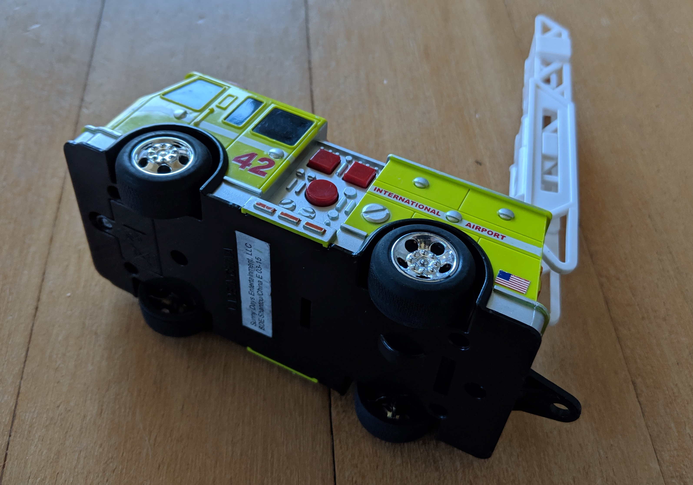

Jude stared at the dancing figures on the television as it the music for Glitter Force blared loudly.

"No Gli'er Force" whined Olly, "I want Super Trucks"!

Jude glanced over at Olly annoyed that he'd been distracted from his sparkly super heroes. "No Olly, it's my turn, you've been watching all morning".

Oliver's whine changed to a loud cry as he threw himself to the ground, arms and legs extended, tottering on his stomach as he arched his back, "I WANT SUPER TRUUUUUUUUUUUUUCKS"!

Jude look over to his Da Da who was sitting at the kitchen table staring intently at his phone, oblivious to the fact that Glitter Breeze had just used Sparkle Blizzard for the first time and saved the world from Brooha the witch (and also the wails of Olly on the floor). 

"Olly, be QUIET!!", Jude yelled and grabbed the remote to drown out the toddler's cries with the Glitter Force celebratory concert, a tradition after they'd given the baddies a good beating.

Oliver, sensing his own performance wasn't having the desired affect, looked around for a bludgeoning capable object. There were many options as toys were scattered across the play mat from an earlier toy dumping (while he'd ignored Super Trucks on the TV). He decided on a medium size yellow fire truck that seemed like it would do the trick.

Truck in hand, Oliver walked over and quickly bonked Jude on the side of the head, watching to see his reaction.

Jude who'd forgottern about Olly once the babies cries had disappeared, felt a sharp pain in the side of his head as the blow landed. His eyes welled with tears and he looked over to see Olly truck in hand, face scrunched angrily for having his Super Truck demands ignored.

"Owwwwwwwwww, Olly stop it!" Jude cried and pushed him away.

Olly, quickly recovered his balance and stepped forward to hit Jude again, this time in the face.

Jude cried loudly and looked to Da Da, who by now had set down his phone and was moving quickly to intercept Olly's third strike from landing. Da Da arrived just in time to catch Olly's hand and remove the truck.

Tears streaming down his face, Jude pushed Olly again. This time Olly lost his balance and fell soundly on his butt and began to cry as well.

"Da Da, Olly hit me in the face" Jude sobbed.

"Da Da, Juju push me" cried Olly, tears streaming down his face.

"What is happening down there?" came a shouting Mama's voice from upstairs.

Penny who didn't want to be left out began howling in unison with the boys cries.

Jude and Olly watched as Da Da sat down slowly on the couch and rubbed his face. Suddenly he looked up and asked "Who wants an iPad?".

The tears vanished and all was well with the world again.